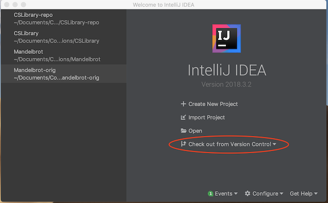
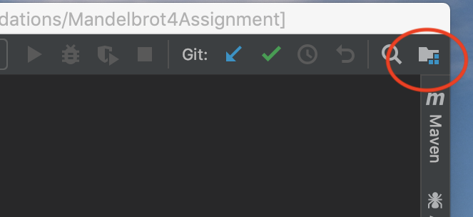
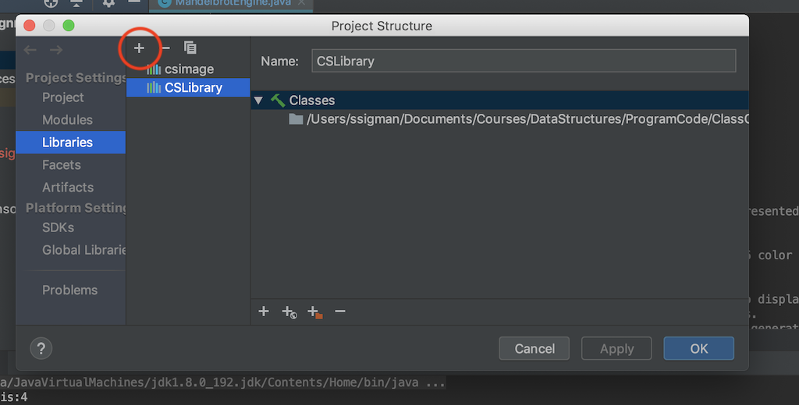
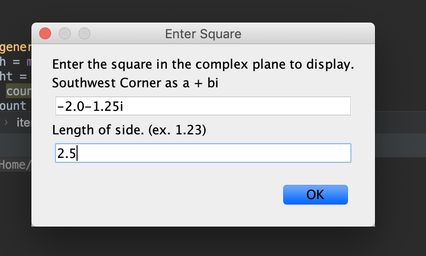

# Mandelbrot4Assignment
## Project Description
This repository contains the  starter code for the Mandelbrot Programming Assignment for CSCI 261: Data Structures.
## Directions
1. Create a new IntelliJ project from this repository by selecting the *Checkout from Version Control* option.  Use the URL of this site and select an appropriate directory location.
    
2. Use the defaults for each page of the create project dialog.
3. Once the project is created, check the Project Structure to verify that the Mandelbrot4Assignment folder is marked as a source root.  The project structure icon is circled in red in the following image.
    
4. Create a link to your CSLibrary as follows:
    * Open the *Project Structure* by using the Project Structure icon.
    * Click on the Libraries menu and use the + command to add a link to your library.  Use the browse to select your CSLibrary project, expand the out folder and the production folder.  Select the CSLibrary entry and click *OK*. Your Libraries tab should resemble the Libraries tab in the following figure.
    
5. Build the project to verify that you have the project configured correctly.  You can do this in one of two ways:
    * From the *Build* menu for IntelliJ, select *Build Project*, or
    * open the *mandelbrotapp* package and execute the main method of the *MandelApp* class.
6. Execute main method of the *mandelbrot.MAndelApp* class and verify that the application runs.  **Note:** at this point the application will only ask for a complex number and a length of a side.  Use -2.0-1.25i for the complex number and 2.5 for the length of the side.  Running the application will result in a window for the application with a blue background displayed.  The startup diaglog for the app is shown in the following figure.
    